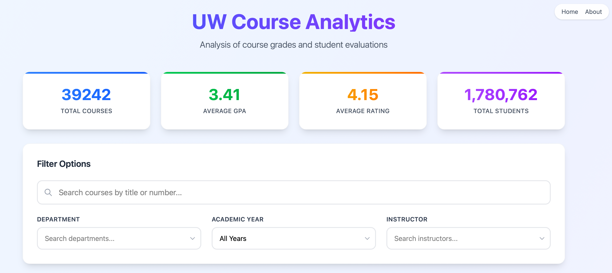
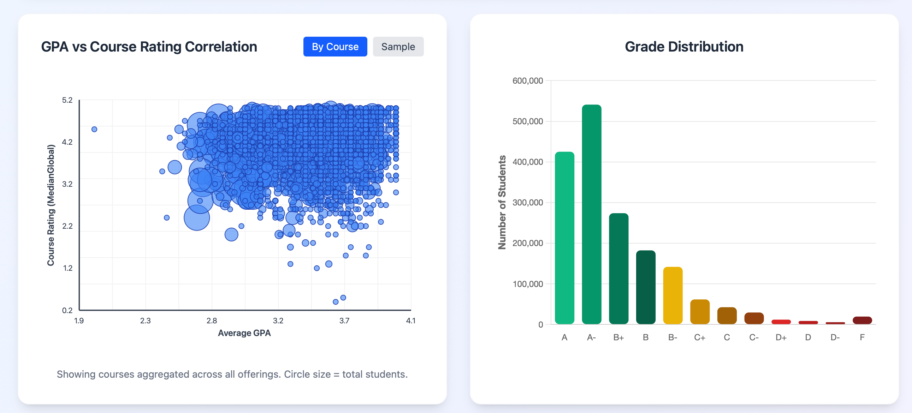
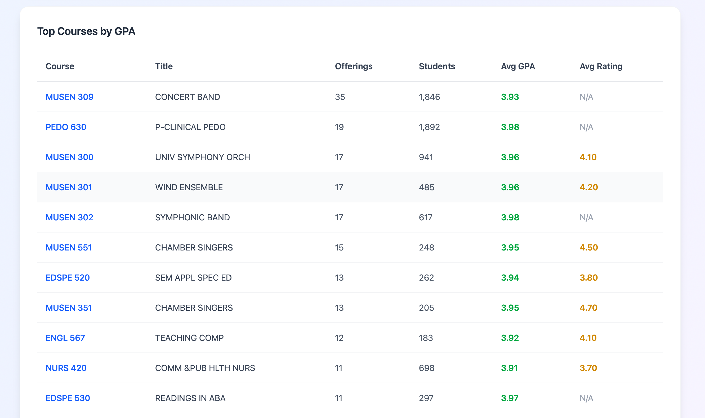

# UW Course Analytics

A web application for analyzing University of Washington course grade distributions, student evaluation ratings, and enrollment statistics. All data obtained through Freedom of Information Act (FOIA) requests.

## Features

- **Interactive Data Visualization:** Scatter plots showing GPA vs. course rating correlations
- **Grade Distribution Charts:** Visual breakdown of grade distributions across courses
- **Advanced Filtering:** Search by course title/number, filter by department, year, or instructor
- **Top Courses Table:** Rankings of courses by GPA with detailed statistics
- **Course Detail Pages:** In-depth analysis of individual courses including instructor history

## Screenshots

## Tech Stack

- **Frontend:** SvelteKit 5 with TypeScript
- **Styling:** Tailwind CSS 4
- **Charts:** Chart.js for grade distributions, custom SVG for scatter plots
- **Deployment:** Vercel
- **Data Processing:** Custom CSV parser with build-time data transformation

## Data Sources

All data is publicly available information obtained through FOIA requests:

- Course grade distributions and enrollment numbers
- Student course evaluation ratings (MedianGlobal scores)
- Academic years covered: 2010-2016 (FOIA Request for 2016-2025 data pending)
- Updated: 08/8/25

## Contributing

Contributions are welcome.

## License

This project is open source and available under the MIT License.

---

**Live Site:** [UW Stats](https://uw-stats.vercel.app)
